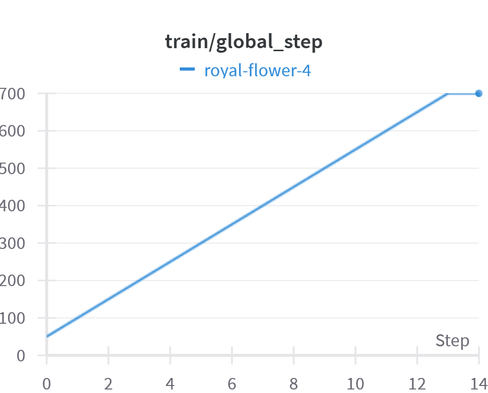
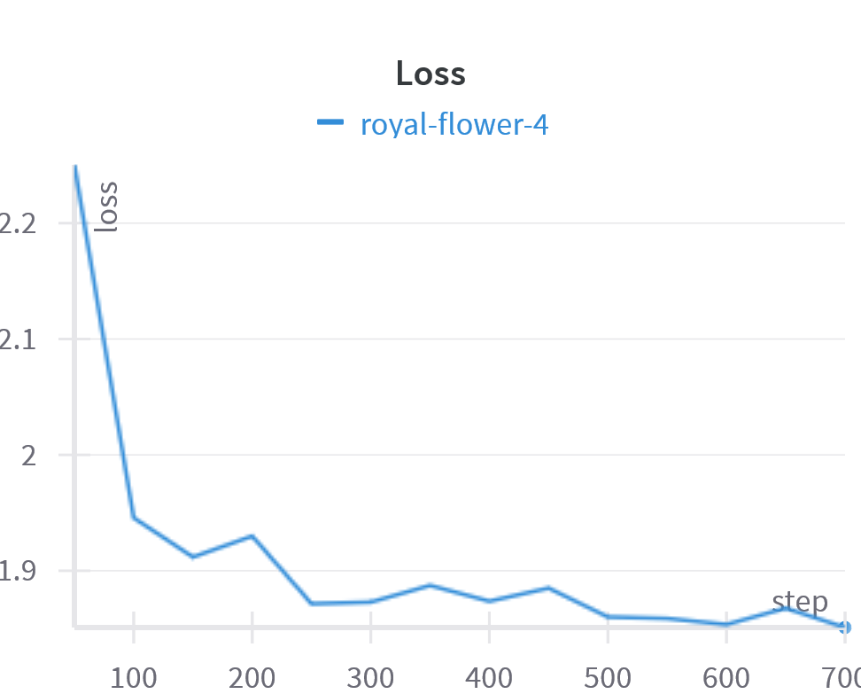
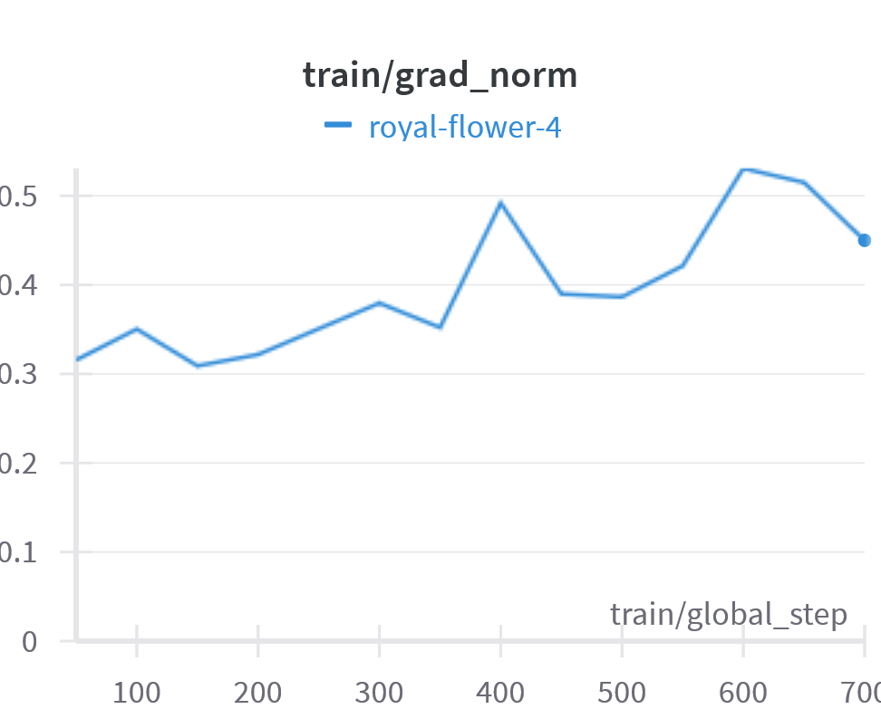

# Отчет. Домашнее Задание 2.
*Генеративный чат-бот*

### Датасет и обработка данных
Датасет взят на Kaggle.com
https://www.kaggle.com/datasets/pierremegret/dialogue-lines-of-the-simpsons
Он представляет собой диалоги из мультфильма Симпсоны. 
Обработка данных выполнена в ноутбуке [Preparing_dataset_Homer](https://github.com/maxbobrov85/chat_bot_gen/blob/main/Preparing_dataset_Homer.ipynb). Для датасета были разобраны диалоги, были выделены вопросы, ближайшие к этому вопросу реплики участников, ответы (хорошие и плохие) подобраные с помощью TF-IDF и т.д. После обработки сформирован окончательный датасет [talks_dataset.df](https://github.com/maxbobrov85/chat_bot_gen/blob/main/talks_dataset.df)
### Модель
*Требуется GPU*

Модель взята предобученая PY007/TinyLlama-1.1B-step-50K-105b с huggingface и доубечена с помощью peft Lora на наш датасет.
Графики обучения модели (training_loss) представлен на рисунке

  

Отчет с wanbd - https://github.com/maxbobrov85/chat_bot_gen/blob/main/Чат-бот huggingface – Weights & Biases.pdf

### Инференс
Ускорение инференса включало в себя загрузку модели в формате bfloat16 и квантизацию (bit4)
Сам инференс состоит из 2 файлов. Загрузка моделей и генерация ответов прописаны в [answgen.py](https://github.com/maxbobrov85/chat_bot_gen/blob/main/answgen.py). Описание flask приложения и хранение контекста вопросов реализовано в [app.py](https://github.com/maxbobrov85/chat_bot_gen/blob/main/app.py).

